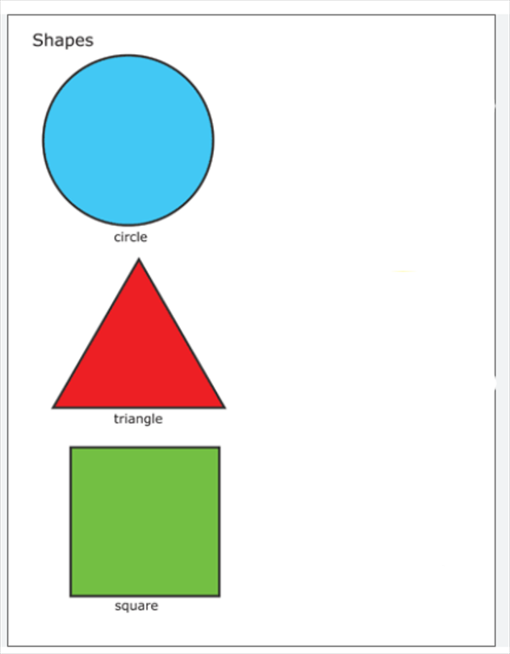
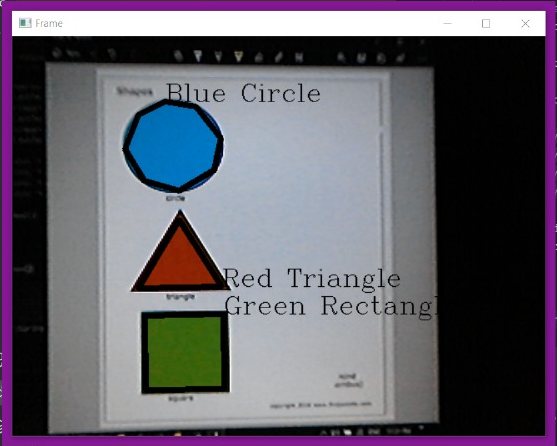

# Shape & Color Recognition System

   

## 📌 Overview
This project is a **real-time shape and color recognition system** using **OpenCV** and **Python**. It detects and classifies **triangles, rectangles, and circles** based on their color (**red, green, and blue**) from a live video feed.

## 🚀 Features
✅ Real-time shape detection & classification 📷  
✅ Identifies **Red, Green, and Blue** objects 🎨  
✅ Uses **HSV color filtering** for accuracy 🎯  
✅ Works with **live webcam feed** 🎥  

## 🛠️ Technologies Used
- **Python 3.8+**
- **OpenCV 4.11**
- **NumPy**

## 📌 Installation
1. Clone the repository:
   ```bash
   git clone https://github.com/Mohamed-Montasser/shape-color-recognition.git
   cd shape-color-recognition
   ```
2. Install dependencies:
   ```bash
   pip install opencv-python numpy
   ```
3. Run the script:
   ```bash
   python shape_recognition.py
   ```

## 🎯 How It Works
- Captures **real-time video feed** from the webcam.
- Converts frames to **HSV color space** for better color filtering.
- Uses **contour detection** to find shapes.
- Classifies the shape based on the number of edges:
  - **3 edges** → Triangle 🔺
  - **4 edges** → Rectangle ◼️
  - **>6 edges** → Circle ⚫
- Displays detected shapes with labels on the screen.

## 🖼️ Example
| Detected Shapes | Test | Result |
|----------------|---------|---------|
| Blue Circle - Red Triangle - Green Rectangle |  | |

## 🏆 Future Enhancements
- Support for **more colors** (yellow, cyan, etc.) 🌈
- Improve shape detection accuracy using **Deep Learning** 🧠
- Add a **GUI interface** for user control 🖥️

## 🤝 Contributing
Contributions are welcome! Feel free to **fork** the repo and submit a **pull request**. 🚀

## 📄 License
This project is licensed under the **MIT License**.

---
🔗 **Developed by Mohamed Montasser**
